# Data Observatory

**پلتفرم یکپارچه مشاهده‌پذیری، کاتالوگ، هوش مصنوعی و تحلیل داده**

> از دریاچهٔ داده تا انبار، از کیفیت و تازگی تا مدل‌سازی و داشبورد — همه در یک محیط آفلاین، فارسی و آمادهٔ سازمان.


---

## معرفی

 یک مرکز عملیات داده (Data Ops Hub) که برای تیم‌های داده، تحلیل‌گران و مدیران ساخته شده تا بدون پراکندگی ابزارها، کل چرخهٔ عمر داده را در یکجا ببینند و مدیریت کنند.

به‌جای جابه‌جایی بین چند نرم‌افزار جدا (کاتالوگ، مانیتورینگ، SQL IDE، BI، ML و ETL)، این پروژه همان قابلیت‌ها را در یک رابط یکپارچه جمع کرده است:

| لایه | چه می‌کند |
| -------------------- | -------------------------------------------------------- |
| **مشاهده و کاتالوگ** | کشف جداول، پروفایل آماری، مقایسه و متادیتای غنی برای AI |
| **کیفیت و عملیات** | Freshness، SLA، رشد حجم، هشدارها |
| **هوش و تحلیل** | دستیار فارسی با دسترسی به داده و متادیتا، نمودار و گزارش |
| **مدل‌سازی** | ویزارد ML شبیه RapidMiner + Notebook متصل به داده |
| **ساخت و تحویل** | Pipeline Studio برای انبار، SQL Explorer و BI Studio |

طراحی برای محیط‌های **سازمانی و آفلاین** است: اتصال به PostgreSQL، متادیتای محلی، و دستیار مبتنی بر مدل‌های محلی (مثل Ollama).

---

## نمای کلی قابلیت‌ها

- کاتالوگ زنده جداول با آمار رکورد، فیلد، حجم و نمونه
- متادیتای استاندارد ستون‌به‌ستون برای RAG و Agentها
- مانیتورینگ تازگی داده و آستانه‌های SLA
- پروفایل آماری و روند رشد جداول
- دستیار AI برای سؤال به زبان طبیعی، تحلیل و نمودار
- استودیوی یادگیری ماشین مرحله‌به‌مرحله + Notebook حرفه‌ای
- طراحی گرافیکی پایپ‌لاین و Materialize به انبار
- SQL Explorer و BI شبیه Power BI با ذخیره و دانلود داشبورد

---

## تب‌ها

### 1. Data Catalog

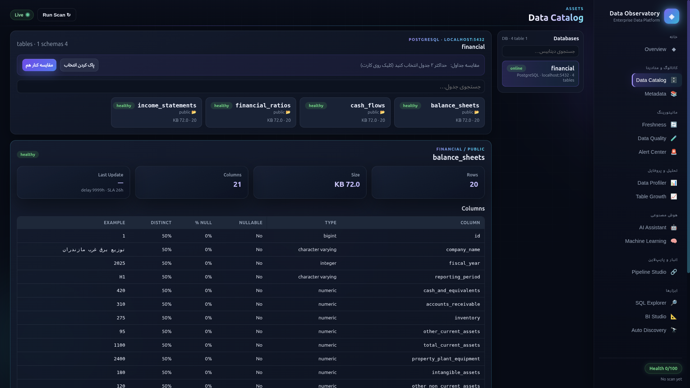

خلاصهٔ وضعیت جداول موجود در دیتابیس را یکجا می‌بینید؛ از جمله:

- تعداد رکوردها
- تعداد فیلدها
- حجم مصرفی

و برای هر فیلد:

| Column | Type | Nullable | Null % | Distinct | Example |
| ------ | ---- | -------- | ------ | -------- | ------- |

**امکان انتخاب و مقایسهٔ هم‌زمان دو جدول** نیز وجود دارد تا ساختار و آمار کنار هم بررسی شوند.

---

### 2. Metadata

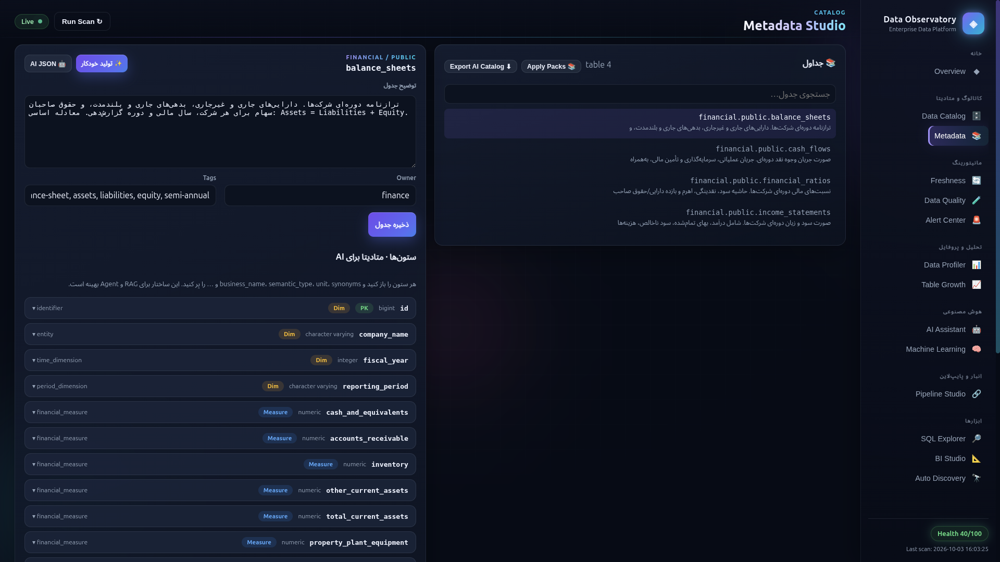

**مهم‌ترین لایه برای هوش مصنوعی برنامه.**

در این تب برای هر جدول و تک‌تک ستون‌ها متادیتا تعریف می‌شود — به‌صورت دستی یا با **تولید خودکار**. این متادیتا در مخزن جدا و با ساختار استاندارد ذخیره می‌شود و دستیار AI هنگام تحلیل، دقیقاً از همین تعاریف استفاده می‌کند.

نمونه‌ای از فیلدهای قابل ذخیره برای هر ستون:

`business_name` · `description` · `semantic_type` · `unit` · `synonyms` · `business_definition` · `calculation_formula` · `allowed_values` · `is_measure` · `is_dimension` و …

هدف: متادیتایی که برای Agent و RAG بهینه، دقیق و قابل‌مصرف باشد — نه فقط یک توضیح آزاد.

---

### 3. Freshness

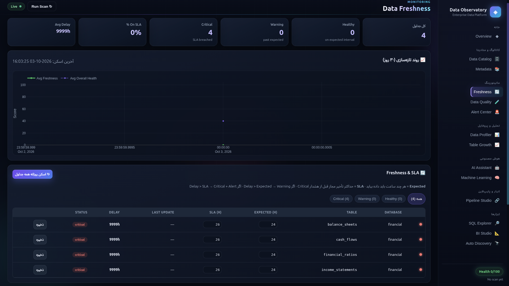

یکی از دردهای همیشگی دریاچه‌های داده: **جدول کی به‌روز شده و آیا هنوز قابل‌اعتماد است؟**

در این تب برای هر جدول مشخص می‌کنید:

- انتظار به‌روزرسانی چقدر است
- **SLA** قابل‌تحمل شما چیست

اگر تأخیر از آستانهٔ تعریف‌شده بیشتر شود، در تب **Alerts** هشدار ثبت می‌شود. در همین‌جا می‌توانید وضعیت freshness را مانیتور و روند تازه‌سازی را دنبال کنید.

---

### 4. Data Profiler

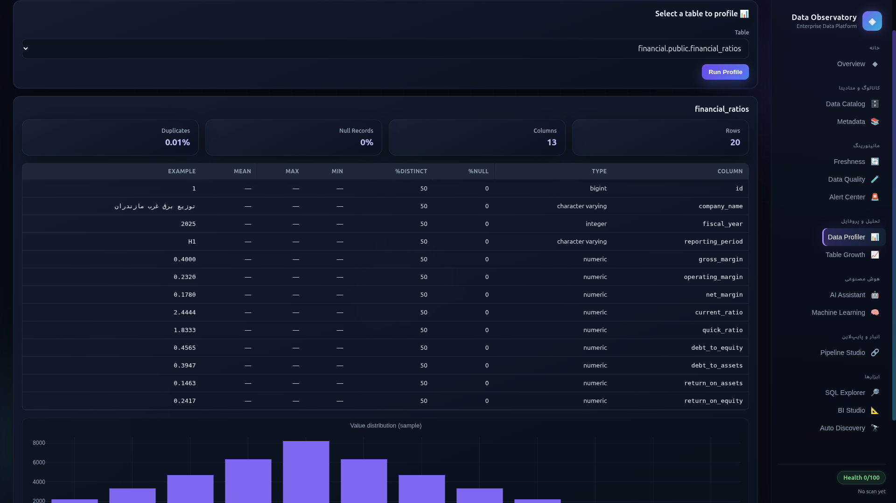

برای **آنالیز آماری سریع** روی جدول انتخابی.

اگر بخواهید در یک نگاه ببینید فیلدها از نظر آماری در چه وضعی هستند (توزیع، null، یکتایی و …)، این تب یک look فشرده و کاربردی می‌دهد — بدون نیاز به نوشتن کوئری اکتشافی از صفر.

---

### 5. Table Growth

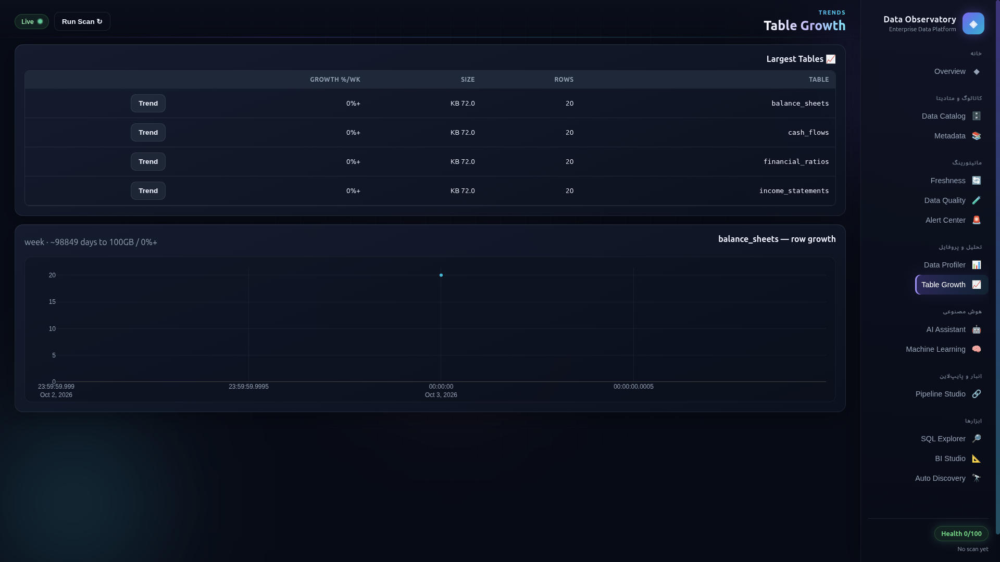

مشکل همیشگی ظرفیت ذخیره‌سازی را هدف گرفته است.

در بسیاری از سازمان‌ها دائماً چک می‌شود که دیسک دریاچه پر نشود و فضای کافی برای جاب‌ها و پایپ‌لاین‌ها بماند. این تب یک **دید نموداری و تاریخی از رشد جداول** می‌دهد تا پیش از اختلال، روند مصرف فضا مشخص باشد.

---

### 6. AI Assistant

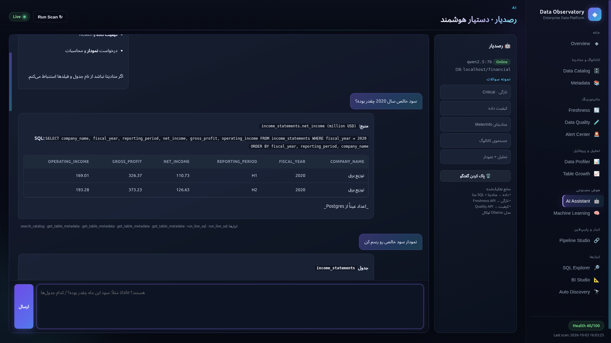
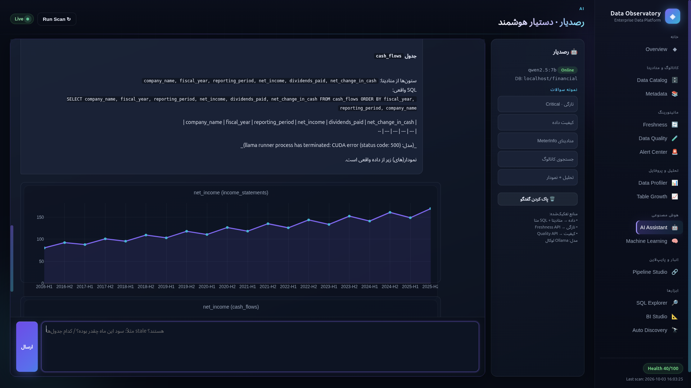

**کاربردی‌ترین ویژگی برای مدیران و تصمیم‌گیرندگان.**

کسانی که لزوماً با SQL یا اصطلاحات فنی راحت نیستند می‌توانند وضعیت را به زبان ساده بپرسند. مثلاً مدیرعامل فقط می‌پرسد: «سود خالص این ماه چقدر بوده؟» — بدون نوشتن کوئری.

دستیار با دسترسی هم‌زمان به **دادهٔ واقعی** و **متادیتا** پاسخ می‌دهد و در صورت نیاز:

- تحلیل پیشرفته انجام می‌دهد
- جستجو و گزارش سریع می‌سازد
- نمودار رسم می‌کند

---

### 7. Machine Learning

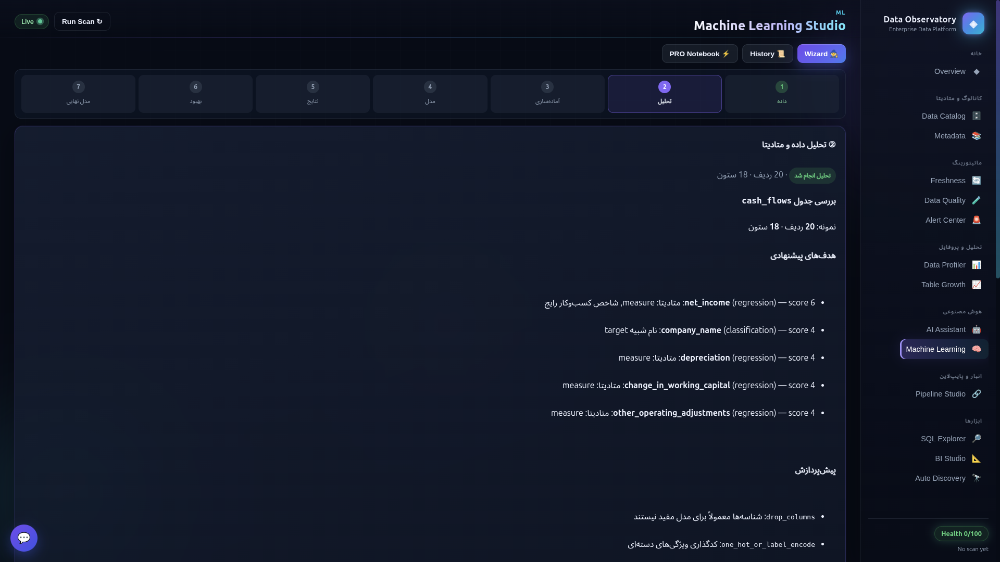
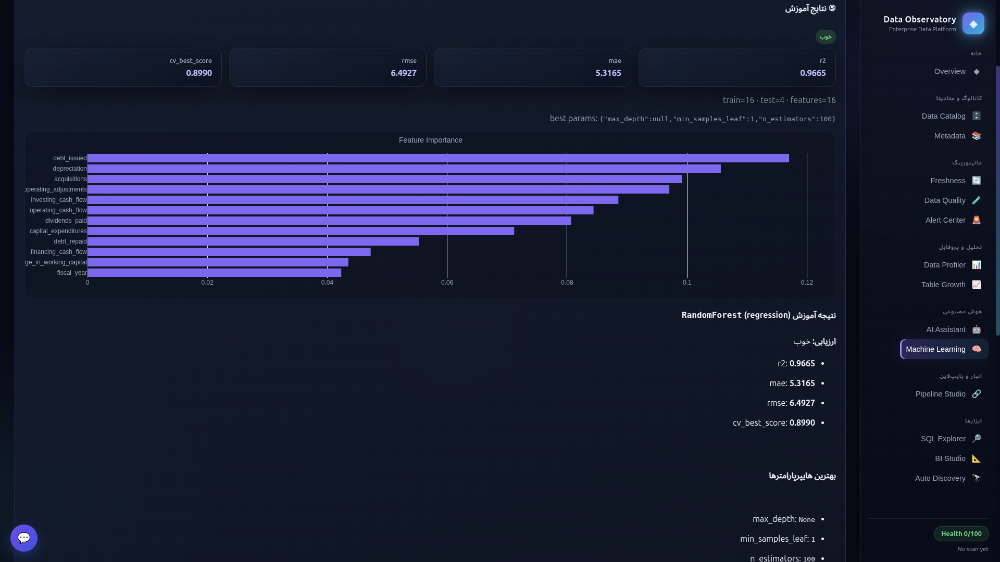
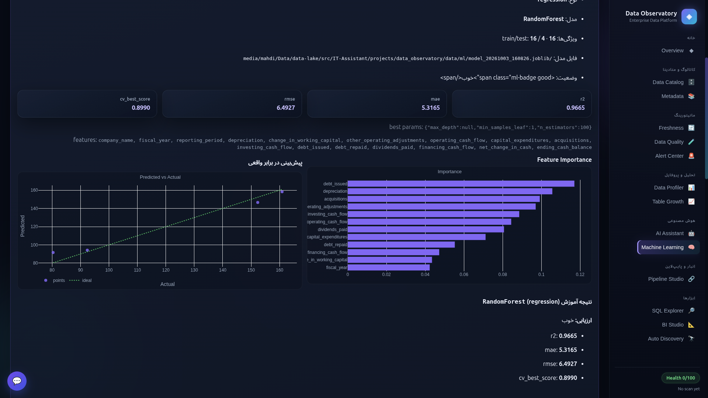

برای **آنالیز و مدل‌سازی سریع**، با الهام از جریان کار ابزارهایی مثل RapidMiner — طوری که حتی بدون تخصص عمیق ML بتوان مسیر پایه را طی کرد.

#### ویزارد مرحله‌به‌مرحله

1. **انتخاب داده** — جدول مورد نظر
2. **تحلیل هوشمند** — بررسی مفهومی، آماری و ساختاری؛ کیفیت داده و پیشنهاد فیلدهای هدف (target)
3. **پیش‌پردازش** — پیشنهاد و اجرای پاک‌سازی (بدون دست‌کاری جدول اصلی؛ روی ویو/نسخهٔ تمیز)
4. **انتخاب و آموزش مدل** — پیشنهاد الگوریتم‌های مناسب و Grid Search
5. **ارزیابی** — متریک‌ها و تحلیل؛ در صورت ضعف، پیشنهاد برگشت و بهبود
6. **ذخیره و استفادهٔ مجدد** — مدل برای پیش‌بینی بعدی آماده می‌ماند

#### Notebook PRO

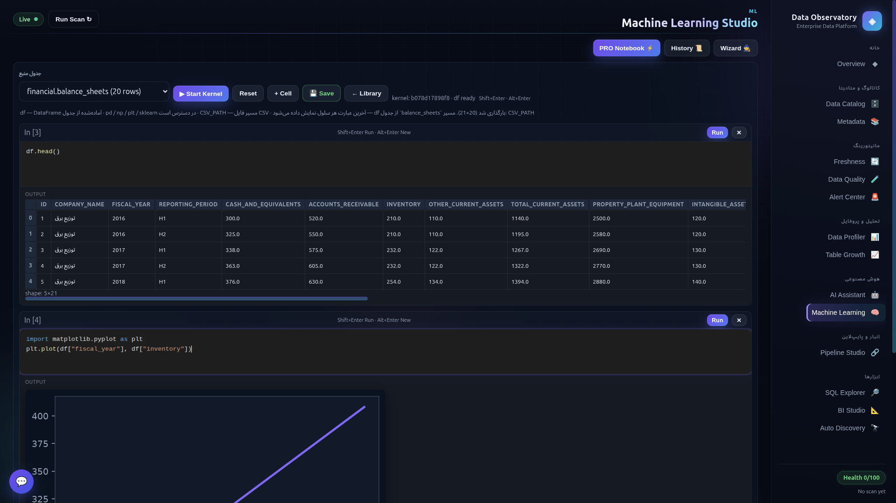

برای کسانی که ویزارد کافی نیست: محیط سلول‌به‌سلول شبیه Jupyter، متصل به داده‌ها، با اجرای کد پایتون و خروجی‌های بصری.

در تمام مراحل این تب، یک **دستیار AI** در پایین صفحه به کل فرایند آگاه است و راهنمایی می‌کند.

---

### 8. Pipeline Studio

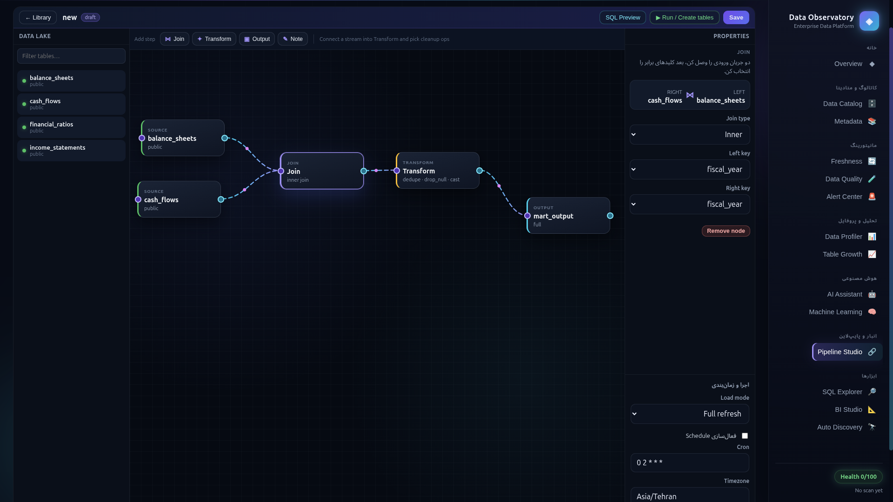
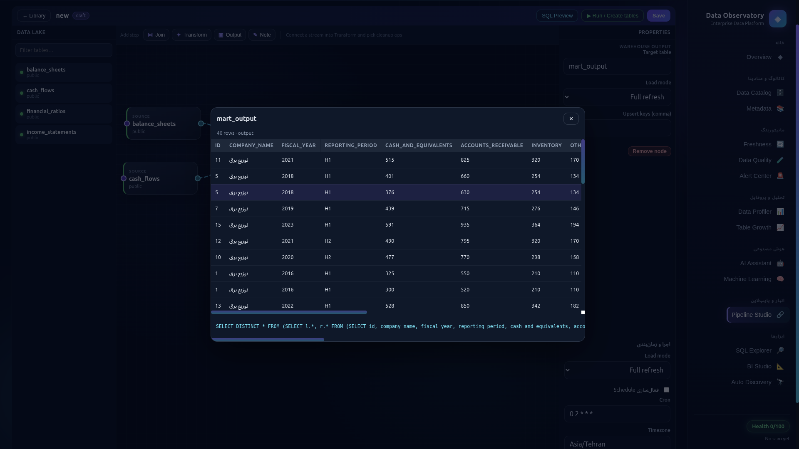

تا اینجا تمرکز روی دریاچه (و دیتابیس‌های متصل) بود؛ اینجا می‌توانید **انبار داده و پایپ‌لاین** را به‌صورت گرافیکی طراحی کنید.

امکانات:

- انتخاب جداول منبع و **Join**
- گره‌های **Transform**
- خروجی با حالت **Full** یا **Upsert**
- زمان‌بندی با **Cron**
- دابل‌کلیک روی هر نود برای پیش‌نمایش داده
- Materialize واقعی جداول در warehouse مقصد

---

### 9. SQL Explorer

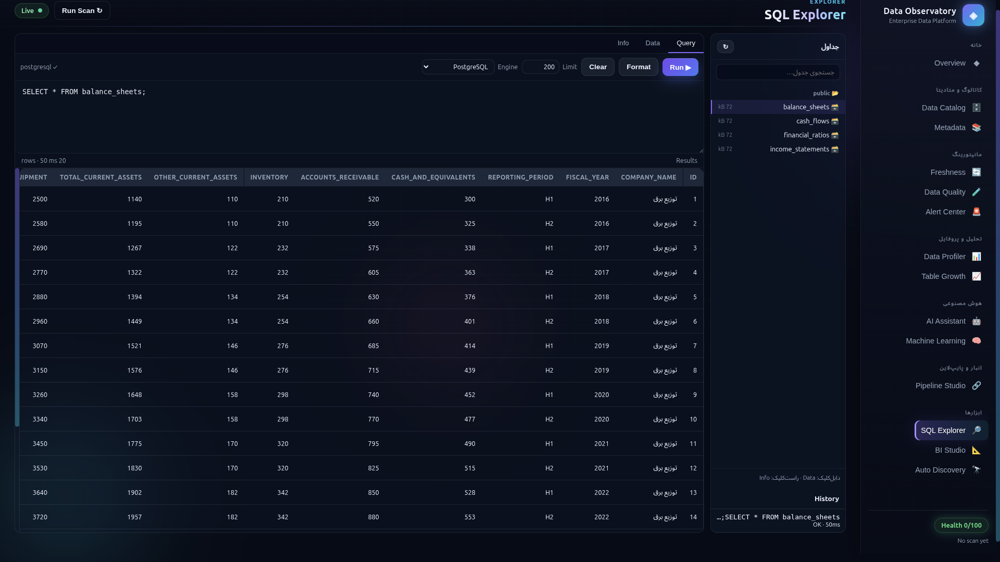

محیط کامل برای اجرای کوئری و کاوش دیتابیس — ساده، خوانا و با امکانات ضروری.

دیگر لازم نیست فقط برای SELECT به یک کلاینت جدا بروید؛ کاتالوگ، پیش‌نمایش جدول و کوئری در همین‌جا کنار هم هستند.

---

### 10. BI Studio

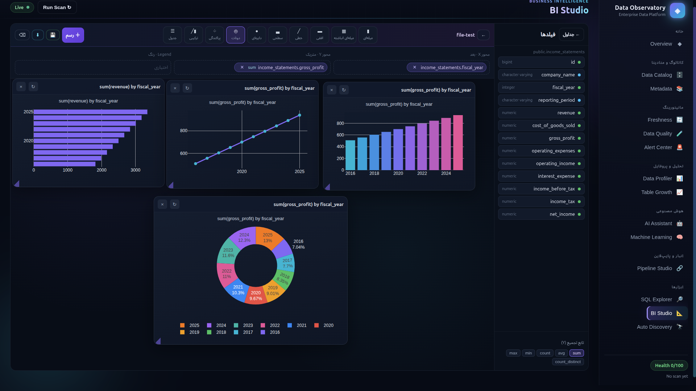

یک **Power BI جمع‌وجور و کاربردی** داخل همان پلتفرم.

جداول را انتخاب می‌کنید، فیلدها را روی محورها می‌چینید، از انواع نمودار رایج استفاده می‌کنید، داشبورد را ذخیره می‌کنید و در صورت نیاز **دانلود** می‌گیرید — با چیدمانی نزدیک به همان چیزی که روی بوم ساخته‌اید.

---

## خلاصه معماری

```
Browser (RTL UI)
    └── FastAPI
          ├── Catalog / Freshness / Quality / Growth
          ├── Metadata store (AI-ready column metadata)
          ├── Live PostgreSQL (lake)
          ├── AI tools + local LLM (e.g. Ollama)
          ├── ML wizard + Notebook kernel
          ├── Pipeline → Warehouse materialize
          └── BI / SQL workspaces (JSON persistence)
```

---

## اجرای سریع

```bash
cd data_observatory
pip install -r requirements.txt
# اتصال دیتابیس از تب Auto Discovery یا تنظیمات محیطی
uvicorn app:app --host 0.0.0.0 --port 8701
```

سپس در مرورگر: `http://localhost:8701`

> برای دستیار AI، سرویس مدل محلی (مثل Ollama) را جداگانه بالا بیاورید.

---

## ساختار پوشهٔ اسکرین‌شات‌ها

اسکرین‌شات‌ها را با این نام‌ها در مسیر زیر قرار دهید:

```
docs/screenshots/
  catalog.png
  metadata.png
  freshness.png
  profiler.png
  growth.png
  assistant.png
  ml1.png
  ml2.png
  ml3.png
  book.png
  pipeline1.png
  pipeline2.png
  sql.png
  bi.png
```

---

## مخاطبان

| نقش | بهره |
| -------------------- | ------------------------------------------- |
| **مدیر / تصمیم‌گیر** | سؤال به زبان طبیعی، گزارش و نمودار بدون SQL |
| **تحلیل‌گر داده** | کاتالوگ، پروفایل، BI، Freshness |
| **مهندس داده** | متادیتا، Pipeline، SQL، رشد جداول |
| **دانشمند داده** | ویزارد ML + Notebook PRO |

---

## فلسفهٔ طراحی

1. **یک سطح شیشه** روی دریاچه و انبار — نه ده ابزار جدا
2. **متادیتا اول** — بدون تعریف کسب‌وکاری، AI حدس می‌زند؛ با متادیتا، دقیق پاسخ می‌دهد
3. **آفلاین‌پذیر** — مناسب شبکهٔ داخلی سازمان
4. **از ساده تا پیشرفته** — مدیر با چت شروع می‌کند؛ مهندس با SQL و Pipeline عمیق می‌شود

---

## مجوز

پروژهٔ داخلی / سازمانی. در صورت انتشار عمومی، مجوز را در همین فایل مشخص کنید.

---

**Data Observatory** — مشاهده، فهم، و اقدام روی داده؛ در یک هاب.
